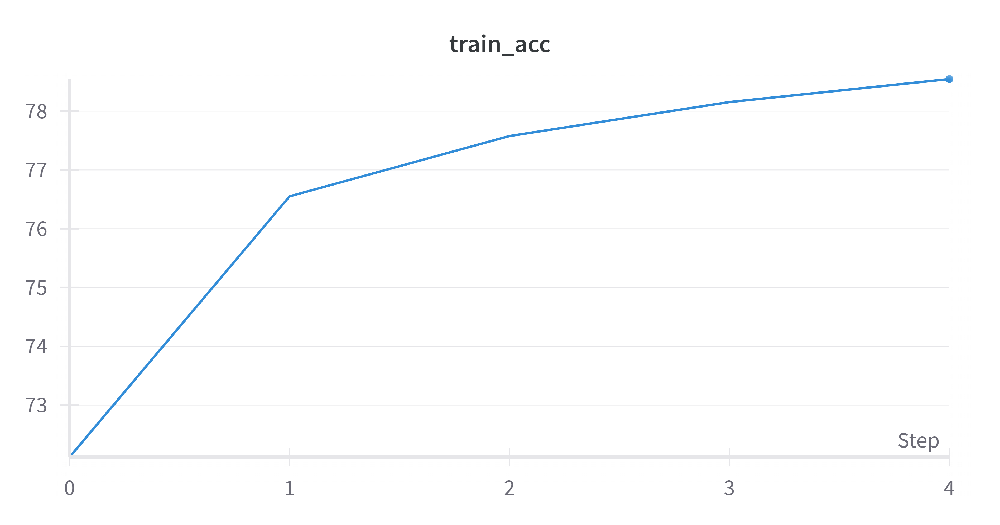
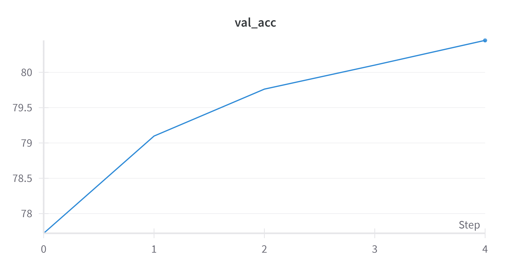
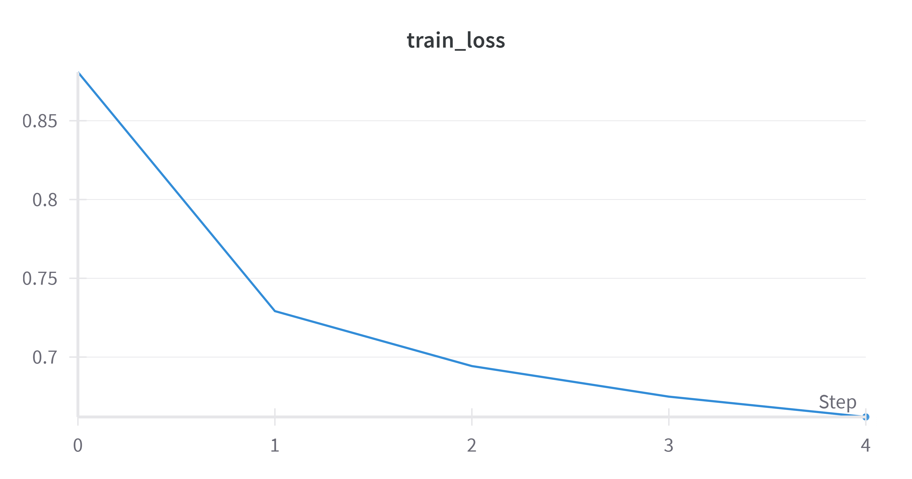
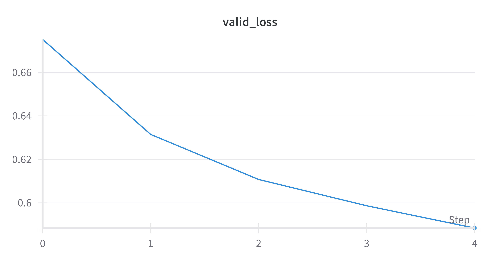
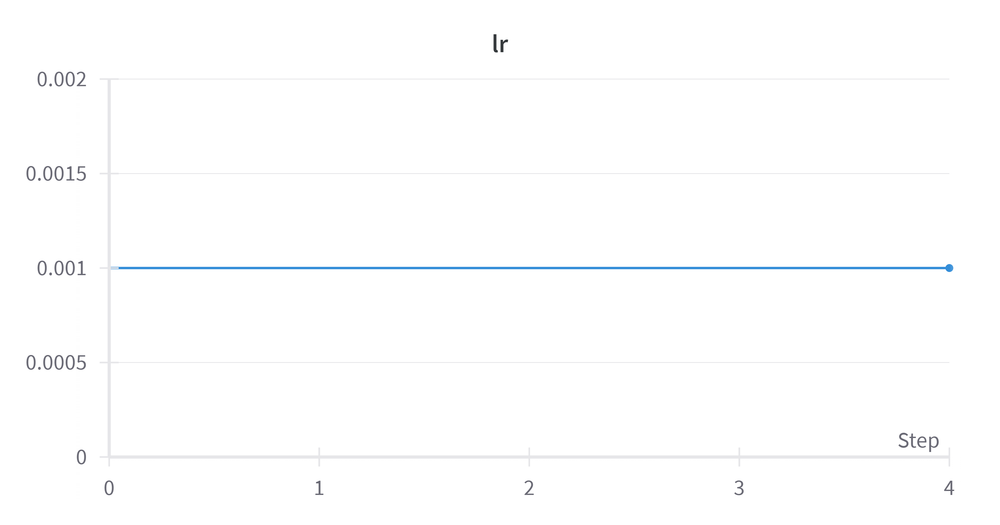

# 🎙️ Frame-Level Phoneme Classifier

*Deep learning-based speech recognition for frame-by-frame phoneme classification*

---

# Project Overview

This project implements a frame-level speech classification system that performs phoneme recognition from audio signals. The model takes Mel-Frequency Cepstral Coefficients (MFCC) features extracted from speech frames as input and classifies them into one of 42 distinct phonemes.

## Problem Statement

Phoneme recognition is a fundamental task in automatic speech recognition (ASR) systems. Traditional approaches often process entire words or sentences, but frame-level classification allows for more granular analysis of speech patterns and can provide better temporal alignment between audio features and phonetic units.

## Approach

- **Input**: MFCC feature vectors extracted from short audio frames (typically 25ms windows)
- **Output**: Classification probabilities across 42 phoneme classes  
- **Architecture**: Frame-by-frame neural network classifier that processes individual MFCC feature vectors

## Key Features

- Frame-level phoneme classification for precise temporal alignment
- Support for 42-phoneme classification (standard phonetic alphabet subset)
- MFCC-based feature extraction for robust acoustic representation
- Real-time inference capability on individual speech frames

## Applications

This frame-level approach enables applications such as:
- Detailed phonetic analysis of speech
- Pronunciation assessment and feedback
- Speech therapy tools
- Linguistic research and analysis
- Building blocks for larger ASR systems

---

# Dataset Information

## Data Source
**Kaggle Competition**: [11785 HW1P2 Fall 2024](https://www.kaggle.com/competitions/11785-hw1p2-f24)

This dataset is part of the CMU 11-785 "Introduction to Deep Learning" course homework assignment focused on frame level classification.

## Dataset Description
The dataset contains preprocessed speech data specifically designed for frame-level phoneme classification tasks. Audio utterances were already preprocessed into raw melspectrograms frames with each frame representing a short temporal segment of speech.

## Dataset Statistics
- **Training Set**: 14,542 utterances (18,482,968 frames)
- **Validation Set**: 2,683 utterances (1,935,669 frames)
- **Test Set**: 2,600 utterances (1,910,012 frames)

## Data Structure

### Input Features
- **Format**: Mel-frequency spectrograms (MFCC features)
- **Dimensions**: 40 features per frame
- **Frame Length**: Variable number of frames per utterance
- **Temporal Resolution**: Each frame represents ~10ms of audio

### Labels
- **Classes**: 42 phoneme categories
- **Format**: Integer labels (0-41)
- **Granularity**: Frame-level labels (one label per frame)

### File Organization
```
dataset/
├── train/
│   ├── mfcc/          # Training MFCC features (.npy files)
│   └── labels/        # Training phoneme labels (.npy files)
├── dev/
│   ├── mfcc/          # Validation MFCC features
│   └── labels/        # Validation phoneme labels
└── test/
    └── mfcc/          # Test MFCC features (labels not provided)
```

## Preprocessing Details
- Audio signals preprocessed into 40-dimensional MFCC feature vectors
- Frame-wise segmentation with overlapping windows
- Features normalized for training stability
- Variable-length sequences handled through padding/batching strategies

---

# Results & Evaluation

## Model Performance
- **Final Training Accuracy**: 78.5458%
- **Final Validation Accuracy**: 80.4530%
- **Final Training Loss**: 0.6620
- **Final Validation Loss**: 0.5884
- **Best Epoch**: 5

## Training Progress

### Accuracy Comparison
| Training Accuracy | Validation Accuracy |
|:---:|:---:|
|  |  |

*Training vs Validation accuracy progression showing model learning and generalization*

### Loss Comparison
| Training Loss | Validation Loss |
|:---:|:---:|
|  |  |

*Training vs Validation loss curves indicating convergence and potential overfitting*

## Additional Metrics

### Learning Rate Schedule

*Learning rate progression during training showing scheduler behavior*

## Key Observations
- Model converged after 5 epochs

# Installation & Setup

## Prerequisites
- Python 3.8 or higher
- CUDA-compatible GPU (recommended for training)

## Quick Start

### 1. Clone the Repository
```bash
git clone https://github.com/RishitSaxena55/Frame-Level-Speech-Recognition.git
cd Frame-Level-Speech-Recognition
```

### 2. Install Dependencies
```bash
pip install -r requirements.txt
```

### 3. Configuration
Update the `config.yml` file with your desired settings:

---

# Usage

## Model Architecture
The model architecture is defined in `models.py`

---

# File Structure
```
frame-level-phoneme-classifier/
├── config.yml                    # Configuration file
├── requirements.txt               # Python dependencies
├── models.py                     # Model architecture definitions
├── phoneme_classifier.ipynb     # Jupyter notebook implementation
├── models/                       # Saved model checkpoints
├── logs/                         # Training logs
├── metrics/                      # Result plots and visualizations
├── submission.csv               # Final predictions for test set
└── README.md                     # This file
```
